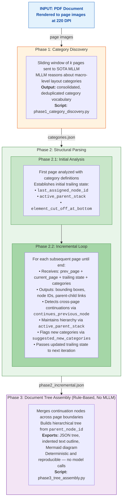

# Multi-Page Document Layout Analysis Pipeline

A **multi-phase, MLLM-powered pipeline** for analyzing complex multi-page documents (ISO standards, quality manuals, government procedures). The system decomposes the hard problem of document layout analysis into focused phases, each with a specialized prompt — producing significantly better results than end-to-end single-prompt approaches.

## Motivation & Research Gap

Traditional DLA models analyze pages independently. But real-world industrial documents (ISO manuals, regulatory filings, technical specifications) have:

- **Cross-page structures**: A section heading on page 5 governs paragraphs on pages 5–8.
- **Page-boundary artifacts**: Text cut mid-sentence, tables split across pages, lists that span multiple pages.
- **Context-dependent categories**: Whether a block is a "definition list" or a "numbered procedure" often depends on the section header 3 pages earlier.

### What We Tried Before This Pipeline

We extensively experimented with existing approaches before arriving at this multi-phase design:

- **SOTA document parsing pipelines** (PaddleOCR, MinerU): These tools work well for simple, single-page documents but fail on complex multi-page layouts with nested hierarchies, cross-page continuations, and context-dependent categories. They lack the semantic understanding needed for structural analysis.
- **Large MLLMs in end-to-end mode** (Qwen3-VL-235B-Thinking, Gemini family, and others): Even the most capable vision-language models — including 235B-parameter reasoning models — produce poor results when asked to do everything in a single prompt. They either over-fragment (detecting hundreds of micro-elements) or under-detect (collapsing structure into a few generic categories). The models have the capability, but the **task formulation** was wrong.

The breakthrough came from **decomposing the problem**: instead of asking one prompt to discover categories + localize elements + infer hierarchy all at once, we split it into focused phases where each phase builds on the previous one's output. The same MLLM that failed in end-to-end mode produces excellent results when given a narrower, well-defined task with the right context.

See [Baseline Experiment](#baseline-experiment-e2e-vs-multi-phase) below for quantitative evidence.

## Pipeline Architecture



> **Script for Phase 2:** `phase2_structural_parsing.py`

## Why Multi-Phase Beats End-to-End

### Baseline Experiment: E2E vs Multi-Phase

We ran both approaches on the same 3 pages of an ISO 9001 Quality Manual using the same SOTA MLLM (temperature=0):

| Metric | Single-Page E2E | Multi-Page E2E (3p) | **Our Pipeline** |
|---|---|---|---|
| Total elements detected | 161 | 26 | **21** |
| Categories discovered | 10 | 5 | **13** |
| Valid bounding boxes | 161 | 26 | **21** |

**Key findings:**

- **Single-page E2E** over-fragments massively (161 elements for 3 pages — it detects individual `table_cell` and `table_row` instead of whole tables). Category vocabulary is ad-hoc and inconsistent across pages.
- **Multi-page E2E** under-detects (26 elements) with only 5 generic categories — loses fine-grained structure.
- **Our pipeline** produces the right granularity (21 elements) with 13 pragmatic, consistent categories that have clear downstream purpose.

Visual comparison available in `outputs/baseline_experiment/`.

## Project Structure

```
multipage_dla/
├── .env.example              # Template for API key
├── .gitignore
├── requirements.txt
│
├── config.py                 # Centralized configuration
├── llm_client.py             # MLLM API wrapper (model-agnostic)
├── visualize.py              # Shared bounding box visualization
│
├── phase1_category_discovery.py    # Phase 1: Category reasoning
├── phase2_structural_parsing.py    # Phase 2: Incremental structural parsing
├── phase2_window_based.py          # Phase 2 alternative: sliding window
├── phase3_tree_assembly.py         # Phase 3: Rule-based tree construction
├── baseline_e2e_experiment.py      # Baseline comparison experiment
│
├── example_images/                 # Quality Manual pages (42 pages)
├── iso_generic_pages/              # ISO Generic Manual pages (7 pages)
│
├── outputs/                        # Quality Manual results
│   ├── phase1_categories.json
│   ├── phase2_incremental.json
│   ├── phase2_trailing_states.json
│   ├── phase2_incremental_vis/     # Visualized bounding boxes per page
│   ├── phase3_document_tree.json
│   ├── phase3_outline.txt
│   ├── phase3_mermaid.md           # Mermaid diagram (renders on GitHub)
│   └── baseline_experiment/        # E2E vs pipeline comparison
│
└── outputs_iso_generic/            # ISO Generic Manual results
    ├── phase1_categories.json
    ├── phase2_incremental.json
    ├── phase3_document_tree.json
    ├── phase3_outline.txt
    └── phase3_mermaid.md
```

## Quick Start

### 1. Setup

```bash
cp .env.example .env
# Edit .env and add your API key

pip install -r requirements.txt
```

### 2. Prepare page images

Render your PDF to page images (220 DPI recommended):

```python
import fitz  # PyMuPDF
doc = fitz.open("your_document.pdf")
for i, page in enumerate(doc):
    pix = page.get_pixmap(dpi=220)
    pix.save(f"your_pages/page_{i+1:03d}.png")
```

### 3. Run the pipeline

```bash
# Phase 1: Discover layout categories
python phase1_category_discovery.py --image-dir your_pages/

# Phase 2: Incremental structural parsing
python phase2_structural_parsing.py --image-dir your_pages/

# Phase 3: Build document tree
python phase3_tree_assembly.py
```

### 4. Read the results

- **`outputs/phase1_categories.json`** — Category vocabulary with descriptions and downstream purpose.
- **`outputs/phase2_incremental.json`** — All detected elements with bounding boxes, hierarchy, and cross-page links.
- **`outputs/phase2_incremental_vis/`** — Visual inspection: bounding boxes drawn on each page image.
- **`outputs/phase3_outline.txt`** — Human-readable document structure at a glance.
- **`outputs/phase3_mermaid.md`** — Interactive tree diagram (renders natively on GitHub).
- **`outputs/phase2_trailing_states.json`** — Debug: inspect the trailing state chain across pages.

## Example Documents

### Document 1: ISO 9001:2015 Quality Manual

- **Pages analyzed**: 11 (of 42)
- **Results**: `outputs/`
- **Highlights**:
  - 136 nodes detected, 13 categories
  - Cross-page ToC continuation detected (pages 3→4)
  - 3-level hierarchy: Section → Subsection → Content blocks
  - Section 3 "Terms and Definitions" correctly grouped 64 definition entries under one parent across 5 pages

### Document 2: Generic Manual on ISO 9001 Six Mandatory Procedures

- **Pages analyzed**: 7 (cover, ToC, introduction, first procedure)
- **Results**: `outputs_iso_generic/`
- **Highlights**:
  - 81 nodes, 12 categories, max depth 3
  - Cross-page list continuation detected
  - Handles mixed visual styles (blue headings, italic guidelines, nested tables)

## Key Design Decisions

### Phase 1: Why separate category discovery?

Letting the MLLM **see multiple pages first** and **reason about categories** before localizing anything produces a vocabulary that is:
- **Pragmatic**: Macro-level categories (e.g., `List_Block` instead of `bulleted_list_item` + `numbered_list_item`)
- **Downstream-aware**: Each category has a documented purpose (e.g., "Passed to specialized table parser")
- **Consistent**: Same vocabulary applied uniformly across all pages

### Phase 2: Why split into Initial + Incremental Loop?

**Phase 2.1 (Initial Analysis)** establishes the baseline state from the first page — creating the initial node IDs, parent stack, and category assignments. This bootstraps the trailing state that drives all subsequent analysis.

**Phase 2.2 (Incremental Loop)** then processes each remaining page sequentially, carrying forward the **trailing state mechanism**:
- `last_assigned_node_id` → global ID continuity without post-hoc renumbering
- `active_parent_stack` → hierarchical parenting across page boundaries
- `element_cut_off_at_bottom` / `continues_previous_node` → text merge at page breaks
- `suggested_new_categories` → vocabulary evolution as new page types appear

This design ensures that each page is analyzed with full awareness of all preceding context, enabling accurate cross-page structure detection.

### Phase 3: Why rule-based?

All information needed for tree construction is already in the Phase 2 JSON (`parent_node_id`, `continues_previous_node`). Using an MLLM here would be:
- **Non-deterministic**: Same input → different trees
- **Wasteful**: Paying for API calls to do what a `dict` lookup can do
- **Slower**: Network latency for a CPU-instant operation

## Use Cases

- **Benchmarking**: Generate high-quality layout annotations for complex documents that traditional DLA models struggle with.
- **Training data**: Create bounding-box + category + hierarchy labels for fine-tuning specialized detectors.
- **MLLM-as-a-Judge**: Use as a monitoring/evaluation pipeline in production — compare detector outputs against MLLM-generated ground truth.
- **Document understanding**: Feed the structured tree into downstream RAG pipelines for context-aware retrieval.

## Configuration

All parameters are in `config.py`:

| Parameter | Default | Description |
|---|---|---|
| `MODEL_NAME` | *(configurable)* | SOTA MLLM model identifier |
| `CONTEXT_WINDOW_SIZE` | `3` | Pages per window in Phase 1 |
| `PHASE2_MAX_TOKENS` | `16384` | Max output tokens for Phase 2 |
| `TEMPERATURE` | `0.0` | Deterministic outputs |

## License

Research use. See individual document sources for their respective licenses.
