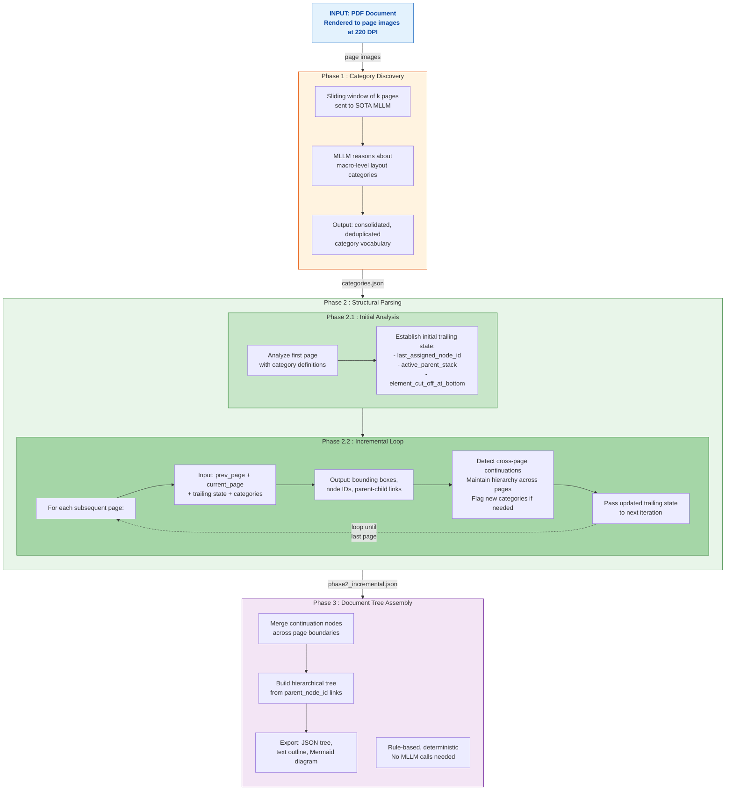

# Multi-Page Document Layout Analysis Pipeline

A **multi-phase, MLLM-powered pipeline** for analyzing complex multi-page documents (ISO standards, quality manuals, government procedures). The system decomposes the hard problem of document layout analysis into focused phases, each with a specialized prompt — producing significantly better results than end-to-end single-prompt approaches.

---

## 1. Problem Formulation

### 1.1 Traditional DLA (Single-Page)

Traditional Document Layout Analysis learns a mapping from a single document image to a set of layout entities:

$$\mathcal{F}(\mathcal{I}) \rightarrow \mathcal{Y} = \lbrace (b_i, c_i) \rbrace_{i=1}^{N}$$

where:
- $b_i = [x_{\min}, y_{\min}, x_{\max}, y_{\max}]$ — **Bounding box** coordinates
- $c_i \in \mathcal{C}$ — **Category label** (Title, Text, Table, Figure, Formula, ...)

This formulation treats each page independently and ignores inter-element relationships.

### 1.2 Extended Formulation: Graph-Based DLA

Modern approaches extend DLA to capture **structural relationships** between elements, formulated as a document graph:

$$\mathcal{Y} = (\mathcal{V}, \mathcal{E})$$

where $\mathcal{V}$ is the set of layout regions (nodes) and $\mathcal{E}$ is the set of relationships (edges) encoding reading order, hierarchical structure (parent-child), and logical grouping.

### 1.3 Our Extension: Cross-Page Multi-Page DLA

We extend the problem further to **multi-page documents** where analyzing a single page requires context from adjacent pages:

$$\mathcal{F}(\mathcal{I}_t \mid \mathcal{I}_{t-1}, \mathcal{S}_{t-1}) \rightarrow (\mathcal{Y}_t, \mathcal{S}_t)$$

where:
- $\mathcal{I}_t$ — Current page image
- $\mathcal{I}_{t-1}$ — Previous page image (adjacent context)
- $\mathcal{S}_{t-1}$ — **Trailing state** from all previously analyzed pages (accumulated context)
- $\mathcal{Y}_t = (\mathcal{V}_t,\; \mathcal{E}_t)$ — Detected layout graph for page $t$, including:
  - $\mathcal{V}_t = \lbrace (b_i, c_i, \text{id}_i, \text{parent}_i) \rbrace$ — Nodes with bounding boxes, categories, unique IDs, and parent links
  - $\mathcal{E}_t$ — Edges encoding hierarchy, reading order, and **cross-page continuations**
- $\mathcal{S}_t$ — Updated trailing state passed to page $t+1$

The trailing state $\mathcal{S}_t$ encodes:
- `last_assigned_node_id` — Global ID counter for continuity
- `active_parent_stack` — Hierarchical context (e.g., Section 1 > 1.1 > 1.1.1)
- `element_cut_off_at_bottom` — Detects text/tables split at page boundaries
- `suggested_new_categories` — Evolving category vocabulary

**Key distinction from traditional DLA:**
- A single page **cannot** be fully analyzed in isolation — category assignment and hierarchy depend on context from preceding pages
- The output is not a flat set of boxes but a **hierarchical document tree** with cross-page links
- The category vocabulary is **document-specific** and discovered dynamically, not fixed a priori

### 1.4 Target Domain

This pipeline targets documents with **extremely complex layouts** that are far from well-structured scientific papers or books:

- **ISO standards & quality manuals** — Deep nested sections, definition lists spanning multiple pages
- **Financial reports** — Multi-page tables, footnotes, cross-references
- **Government procedures** — Mixed visual styles, regulatory formatting, nested numbered lists
- **Technical specifications** — Diagrams interspersed with text, appendices, revision tables

Existing benchmarks (PubLayNet, DocLayNet, DocBank) focus primarily on scientific papers and simple documents — they do not cover these complex, multi-page, cross-referencing layouts.

---

## 2. Motivation & Research Gap

### 2.1 Why Cross-Page Context Matters

Real-world industrial documents have:

- **Cross-page structures**: A section heading on page 5 governs paragraphs on pages 5-8.
- **Page-boundary artifacts**: Text cut mid-sentence, tables split across pages, lists that span multiple pages.
- **Context-dependent categories**: Whether a block is a "definition list" or a "numbered procedure" often depends on the section header 3 pages earlier.

### 2.2 Challenges with Existing Approaches

**Vision-based detection models** (YOLO, RT-DETR, DocLayout-YOLO):
- High bounding box accuracy and fast inference on trained categories
- **Cannot** handle categories outside their training set
- **Cannot** reason about cross-page context or dynamic category assignment

**SOTA MLLM in end-to-end mode** (including 235B-parameter reasoning models):
- Strong semantic reasoning capability
- **Grounding accuracy degrades** as the number of elements increases — the more objects requested, the more coordinates drift
- When asked to do everything in one prompt (discover categories + localize + build hierarchy), they either **over-fragment** or **under-detect**

**SOTA document parsing pipelines** (PaddleOCR, MinerU):
- Work well for simple, single-page documents
- **Fail** on complex multi-page layouts with nested hierarchies and cross-page continuations

### 2.3 Benchmark & Training Data Gap

- No existing benchmark covers multi-page, cross-page DLA with hierarchical annotations
- Creating ground truth requires **expensive human annotation**
- This pipeline serves as an **automated labeling tool** to generate high-quality annotations

### 2.4 What We Tried Before This Pipeline

We extensively experimented with existing approaches:

- **PaddleOCR, MinerU**: Fail on complex multi-page layouts — no cross-page awareness, no hierarchical output
- **Qwen3-VL-235B-Thinking, Gemini family, and other large MLLMs**: Even 235B-parameter reasoning models produce poor results in end-to-end mode. The models have the capability, but the **task formulation** was wrong.

The breakthrough came from **decomposing the problem**: the same MLLM that failed in end-to-end mode produces excellent results when given a narrower, well-defined task with the right context.

---

## 3. Pipeline Architecture



**Scripts:** `phase1_category_discovery.py` | `phase2_structural_parsing.py` | `phase3_tree_assembly.py`

---

## 4. Algorithm (Pseudocode)

```
Algorithm: Multi-Page Document Layout Analysis
━━━━━━━━━━━━━━━━━━━━━━━━━━━━━━━━━━━━━━━━━━━━━━

Input:  D = {I_1, I_2, ..., I_n}    // n page images from PDF (rendered at 220 DPI)
Output: T = Document Tree             // hierarchical tree with bounding boxes, categories, relations

═══════════════════════════════════════
  PHASE 1: Category Discovery
═══════════════════════════════════════

  categories ← ∅

  for w = 1 to ⌈n/k⌉ do                           // sliding window, k pages per window
      window ← {I_{(w-1)k+1}, ..., I_{min(wk, n)}}
      cats_w ← MLLM(window, CATEGORY_DISCOVERY_PROMPT)
      categories ← MERGE_AND_DEDUPLICATE(categories, cats_w)
  end for

  // categories = {(class_name, description, downstream_purpose), ...}

═══════════════════════════════════════
  PHASE 2.1: Initial Analysis
═══════════════════════════════════════

  elements   ← []
  state_0    ← INIT_TRAILING_STATE()               // {node_id_counter: 0, parent_stack: [], cut_off: null}

  (Y_1, S_1) ← MLLM(I_1, null, state_0, categories, STRUCTURAL_PARSING_PROMPT)
  elements   ← elements ∪ Y_1

═══════════════════════════════════════
  PHASE 2.2: Incremental Loop
═══════════════════════════════════════

  for t = 2 to n do
      (Y_t, S_t) ← MLLM(I_t, I_{t-1}, S_{t-1}, categories, STRUCTURAL_PARSING_PROMPT)

      // Y_t contains for each detected element:
      //   - node_id (globally unique, continuing from S_{t-1})
      //   - category ∈ categories
      //   - box_2d = [ymin, xmin, ymax, xmax] normalized to 1000×1000
      //   - parent_node_id (hierarchy link, possibly to node on earlier page)
      //   - continues_previous_node (cross-page continuation link)
      //   - content_snippet

      elements ← elements ∪ Y_t

      // S_t carries forward:
      //   - last_assigned_node_id
      //   - active_parent_stack (e.g., [Section 4, Subsection 4.1])
      //   - element_cut_off_at_bottom
      //   - suggested_new_categories → merged into categories if valid
  end for

═══════════════════════════════════════
  PHASE 3: Document Tree Assembly
  (Rule-based, no MLLM)
═══════════════════════════════════════

  // Step 3a: Merge continuation nodes
  for each element e where e.continues_previous_node ≠ null do
      target ← RESOLVE_CHAIN(e.continues_previous_node)
      target.snippet ← target.snippet + " " + e.snippet
      REMAP_REFERENCES(e.node_id → target.node_id)
      REMOVE(e)
  end for

  // Step 3b: Build hierarchical tree
  T ← EMPTY_FOREST()
  for each element e do
      if e.parent_node_id = null then
          T.add_root(e)
      else if e.parent_node_id ∈ elements then
          PARENT(e.parent_node_id).add_child(e)
      else
          T.add_root(e)        // orphan → attach to root
      end if
  end for

  // Step 3c: Export
  EXPORT_JSON(T)                // phase3_document_tree.json
  EXPORT_OUTLINE(T)             // phase3_outline.txt
  EXPORT_MERMAID(T)             // phase3_mermaid.md

  return T
```

---

## 5. MLLM Prompts

The quality of the pipeline depends critically on prompt design. Below are the actual prompts used in each phase.

### 5.1 Phase 1 Prompt: Category Discovery

> Sent to the MLLM along with a sliding window of page images.

```
[Role]
You are an Industrial-Grade Document Layout Analysis (DLA) Agent. Your primary
function is to visually analyze multi-page document inputs and define a pragmatic,
highly generalizable set of layout categories (labels) for an automated processing
pipeline.

[Objective]
Observe the provided multi-page document, reason about its visual and logical
hierarchy, and output a consolidated, practical list of layout categories.

[Design Philosophy & Constraints]
- Be Pragmatic & Robust: Do NOT over-complicate or become overly granular.
  In a production pipeline, too many micro-categories cause fragmentation,
  chunking issues, and logic failures.
- Focus on Macro-Structures: Group elements by their logical boundaries and
  downstream extraction purpose. (e.g., Instead of creating separate labels
  for "bulleted_list_item", "numbered_list_item", or individual lines, use
  a unified macro-level "List_Block" if it serves the same parsing purpose).
- Ignore Micro-Noise: Do not create separate categories for minor visual
  variations unless they fundamentally change how the text should be read
  or processed.
- Downstream-Aware: Every defined category MUST have a clear justification
  for WHY it needs to be isolated (e.g., 'Requires Table Structure Recognition',
  'Acts as a semantic boundary for text chunking', 'Safe to discard as noise').

[Task Instructions]
1. Holistically scan all provided document pages.
2. Identify the recurring, structurally significant components based on the
   design philosophy.
3. Reason about how these components should be grouped for a clean, efficient
   data extraction pipeline.
4. Output your final reasoning and category list in the exact JSON format below.

[Expected JSON Output Format]
{
  "reasoning_process": "A brief, 2-3 sentence explanation of your observation
    across the pages and why you chose to group certain elements together.",
  "categories": [
    {
      "class_name": "StandardizedName (e.g., Title, Text_Block, Table, ...)",
      "description": "Clear, concise definition of the visual and logical
        boundaries of this category.",
      "downstream_purpose": "Practical reason for this category in a data
        pipeline."
    }
  ]
}
```

### 5.2 Phase 2 Prompt: Structural Parsing

> Sent to the MLLM for each page, along with the previous page image, the current page image, the trailing state JSON, and the category definitions from Phase 1.

```
# [Role]
You are an Industrial-Grade Visual Spatial Analyzer and Structural Logic Agent
operating within a Sequential Document Parsing Pipeline.

# [Objective]
Analyze the CURRENT page image, locate every instance of the defined layout
categories, assign globally sequential node IDs, and infer logical & hierarchical
relationships — using the Trailing State from the previous page to maintain
cross-page continuity.

# [Layout Categories]
Locate and classify elements strictly into one of the following categories:

{category_definitions}   ← injected from Phase 1 output

However, if you encounter a visually distinct element that genuinely does NOT fit
ANY of the above categories, you MUST still detect it using the closest existing
category, AND report it in the `suggested_new_categories` section.

# [Rules & Constraints]

## 1. Physical Bounding Boxes (`box_2d`)
- Format: [ymin, xmin, ymax, xmax], normalized to a 1000x1000 grid.
- Boxes must be tight around each element. Do NOT skip any visible element.

## 2. Global ID Sequencing (`node_id`)
- Resume counting from `last_assigned_node_id` + 1.
- Follow reading order: top→bottom, left→right within the page.

## 3. Hierarchical Parenting (`parent_node_id`)
- If an element at the top of this page logically belongs to an open section
  from the previous page, set `parent_node_id` to the matching entry in
  `active_parent_stack`.
- Top-level elements → null.

## 4. Cross-Page Continuation (`continues_previous_node`)
- If the very first content element on this page is a direct continuation of
  text/list cut off at the bottom of the previous page (see
  `element_cut_off_at_bottom` in the Trailing State), set this field to
  that node's ID. Otherwise → null.

## 5. Content Snippet (`content_snippet`)
- First 100 characters only — for grounding/verification, NOT full extraction.

## 6. Producing the Trailing State for the Next Page
At the end of your response, output a `trailing_state_for_next` object:
- `last_assigned_node_id`: the highest node_id assigned on this page.
- `active_parent_stack`: list of section headings that remain "open" at the
  bottom of this page (outermost→innermost).
- `element_cut_off_at_bottom`: if the last element appears truncated, provide
  its node_id, category, and snippet. Otherwise → null.

## 7. New Category Suggestions (`suggested_new_categories`)
- If you detect an element that does NOT fit well into any defined category,
  classify it with the closest match AND add an entry here.

# [Expected JSON Output]
{
  "page_metadata": {
    "current_image_index": "integer",
    "total_nodes_detected_on_page": "integer"
  },
  "detected_elements": [
    {
      "node_id": "string",
      "image_index": "integer",
      "category": "string",
      "box_2d": [ymin, xmin, ymax, xmax],
      "content_snippet": "string (max 100 chars)",
      "parent_node_id": "string | null",
      "continues_previous_node": "string | null",
      "reasoning": "Brief 1-sentence justification."
    }
  ],
  "trailing_state_for_next": {
    "last_assigned_node_id": "string",
    "active_parent_stack": [
      { "node_id": "string", "category": "string", "snippet": "string" }
    ],
    "element_cut_off_at_bottom": {
      "node_id": "string", "category": "string", "snippet": "string"
    } or null
  },
  "suggested_new_categories": [
    {
      "proposed_class_name": "string",
      "description": "string",
      "encountered_on_node_id": "string",
      "reason": "string"
    }
  ]
}
```

---

## 6. Baseline Experiment: E2E vs Multi-Phase

We ran both approaches on the same 3 pages of an ISO 9001 Quality Manual using the same SOTA MLLM (temperature=0):

| Metric | Single-Page E2E | Multi-Page E2E (3p) | **Our Pipeline** |
|---|---|---|---|
| Total elements detected | 161 | 26 | **21** |
| Categories discovered | 10 | 5 | **13** |
| Valid bounding boxes | 161 | 26 | **21** |

**Key findings:**

- **Single-page E2E** over-fragments massively (161 elements for 3 pages — it detects individual `table_cell` and `table_row` instead of whole tables). Category vocabulary is ad-hoc and inconsistent across pages.
- **Multi-page E2E** under-detects (26 elements) with only 5 generic categories — loses fine-grained structure.
- **Our pipeline** produces the right granularity (21 elements) with 13 pragmatic, consistent categories that have clear downstream purpose.

Visual comparison available in `outputs/baseline_experiment/`.

---

## 7. Example Documents

### Document 1: ISO 9001:2015 Quality Manual

- **Pages analyzed**: 11 (of 42)
- **Results**: `outputs/`
- **Highlights**:
  - 136 nodes detected, 13 categories
  - Cross-page ToC continuation detected (pages 3->4)
  - 3-level hierarchy: Section -> Subsection -> Content blocks
  - Section 3 "Terms and Definitions" correctly grouped 64 definition entries under one parent across 5 pages

### Document 2: Generic Manual on ISO 9001 Six Mandatory Procedures

- **Pages analyzed**: 7 (cover, ToC, introduction, first procedure)
- **Results**: `outputs_iso_generic/`
- **Highlights**:
  - 81 nodes, 12 categories, max depth 3
  - Cross-page list continuation detected
  - Handles mixed visual styles (blue headings, italic guidelines, nested tables)

---

## 8. Research Roadmap

This pipeline is the first step toward a larger research agenda:

### 8.1 Proposed Labeling Pipeline

Combine **vision-based detectors** (SOTA bounding box detection) with **SOTA MLLMs** (category assignment + relation reasoning):
- Detectors provide accurate bounding boxes (what they do best)
- MLLMs rewrite categories and resolve hierarchical relations (what they do best)
- Result: high-quality benchmark + training dataset without expensive human annotation

### 8.2 Planned Experiments

1. **Inference-based approaches**: Test SOTA parsing pipelines (PaddleOCR, MinerU) combined with MLLM reasoning for category/relation assignment
2. **Prompt-based end-to-end MLLM**: Send page image sequences + instructions, output layout analysis directly
3. **Fine-tuning approaches**:
   - *Direction A*: Fine-tune a small VLM to correct categories and resolve relations from detector outputs
   - *Direction B*: Fine-tune an end-to-end VLM that takes PDF image sequences and outputs full layout analysis
4. **Model optimization**: If fine-tuning succeeds, apply compression/distillation for production deployment

### 8.3 Data Goals

- Collect PDFs with complex layouts requiring cross-page context for analysis
- Build automated labeling pipeline using this system
- Target: **2K benchmark samples** (with ground truth) + **20K training samples**

---

## 9. Key Design Decisions

### Phase 1: Why separate category discovery?

Letting the MLLM **see multiple pages first** and **reason about categories** before localizing anything produces a vocabulary that is:
- **Pragmatic**: Macro-level categories (e.g., `List_Block` instead of `bulleted_list_item` + `numbered_list_item`)
- **Downstream-aware**: Each category has a documented purpose (e.g., "Passed to specialized table parser")
- **Consistent**: Same vocabulary applied uniformly across all pages

### Phase 2: Why split into Initial + Incremental Loop?

**Phase 2.1 (Initial Analysis)** establishes the baseline state from the first page — creating the initial node IDs, parent stack, and category assignments. This bootstraps the trailing state that drives all subsequent analysis.

**Phase 2.2 (Incremental Loop)** then processes each remaining page sequentially, carrying forward the **trailing state mechanism**:
- `last_assigned_node_id` -> global ID continuity without post-hoc renumbering
- `active_parent_stack` -> hierarchical parenting across page boundaries
- `element_cut_off_at_bottom` / `continues_previous_node` -> text merge at page breaks
- `suggested_new_categories` -> vocabulary evolution as new page types appear

### Phase 3: Why rule-based?

All information needed for tree construction is already in the Phase 2 JSON (`parent_node_id`, `continues_previous_node`). Using an MLLM here would be:
- **Non-deterministic**: Same input -> different trees
- **Wasteful**: Paying for API calls to do what a `dict` lookup can do
- **Slower**: Network latency for a CPU-instant operation

---

## 10. Project Structure

```
multipage_dla/
├── .env.example              # Template for API key
├── .gitignore
├── requirements.txt
│
├── config.py                 # Centralized configuration
├── llm_client.py             # MLLM API wrapper (model-agnostic)
├── visualize.py              # Shared bounding box visualization
│
├── phase1_category_discovery.py    # Phase 1: Category reasoning
├── phase2_structural_parsing.py    # Phase 2: Incremental structural parsing
├── phase2_window_based.py          # Phase 2 alternative: sliding window
├── phase3_tree_assembly.py         # Phase 3: Rule-based tree construction
├── baseline_e2e_experiment.py      # Baseline comparison experiment
│
├── example_images/                 # Quality Manual pages (42 pages)
├── iso_generic_pages/              # ISO Generic Manual pages (7 pages)
│
├── outputs/                        # Quality Manual results
│   ├── phase1_categories.json
│   ├── phase2_incremental.json
│   ├── phase2_trailing_states.json
│   ├── phase2_incremental_vis/     # Visualized bounding boxes per page
│   ├── phase3_document_tree.json
│   ├── phase3_outline.txt
│   ├── phase3_mermaid.md           # Mermaid diagram (renders on GitHub)
│   └── baseline_experiment/        # E2E vs pipeline comparison
│
└── outputs_iso_generic/            # ISO Generic Manual results
    ├── phase1_categories.json
    ├── phase2_incremental.json
    ├── phase3_document_tree.json
    ├── phase3_outline.txt
    └── phase3_mermaid.md
```

## 11. Quick Start

### Setup

```bash
cp .env.example .env
# Edit .env and add your API key

pip install -r requirements.txt
```

### Prepare page images

Render your PDF to page images (220 DPI recommended):

```python
import fitz  # PyMuPDF
doc = fitz.open("your_document.pdf")
for i, page in enumerate(doc):
    pix = page.get_pixmap(dpi=220)
    pix.save(f"your_pages/page_{i+1:03d}.png")
```

### Run the pipeline

```bash
# Phase 1: Discover layout categories
python phase1_category_discovery.py --image-dir your_pages/

# Phase 2: Incremental structural parsing
python phase2_structural_parsing.py --image-dir your_pages/

# Phase 3: Build document tree
python phase3_tree_assembly.py
```

### Read the results

- **`outputs/phase1_categories.json`** — Category vocabulary with descriptions and downstream purpose
- **`outputs/phase2_incremental.json`** — All detected elements with bounding boxes, hierarchy, and cross-page links
- **`outputs/phase2_incremental_vis/`** — Visual inspection: bounding boxes drawn on each page image
- **`outputs/phase3_outline.txt`** — Human-readable document structure at a glance
- **`outputs/phase3_mermaid.md`** — Interactive tree diagram (renders natively on GitHub)
- **`outputs/phase2_trailing_states.json`** — Debug: inspect the trailing state chain across pages

## Configuration

All parameters are in `config.py`:

| Parameter | Default | Description |
|---|---|---|
| `MODEL_NAME` | *(configurable)* | SOTA MLLM model identifier |
| `CONTEXT_WINDOW_SIZE` | `3` | Pages per window in Phase 1 |
| `PHASE2_MAX_TOKENS` | `16384` | Max output tokens for Phase 2 |
| `TEMPERATURE` | `0.0` | Deterministic outputs |

## Use Cases

- **Automated Labeling**: Generate high-quality layout annotations for documents that are too complex for existing tools
- **Benchmark Creation**: Build ground-truth datasets for cross-page DLA evaluation
- **Training Data**: Create bounding-box + category + hierarchy labels for fine-tuning specialized models
- **MLLM-as-a-Judge**: Compare detector outputs against MLLM-generated ground truth
- **Document Understanding**: Feed the structured tree into downstream RAG pipelines

## License

Research use. See individual document sources for their respective licenses.
