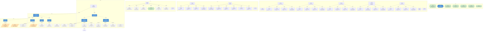

```mermaid
graph TB

    subgraph page_1 [Page 1]
        direction TB
        node_001{{"node_001\nImage\nGovernment Quality Management Program - Citiz"}}
        node_002(["node_002\nTitle\nGeneric Manual on ISO 9001 Six Mandatory Proc"])
        node_003{{"node_003\nImage\nDepartment of Budget and Management logo"}}
        node_004{{"node_004\nImage\nDepartment of Trade and Industry logo"}}
        node_005{{"node_005\nImage\nDepartment of the Interior and Local Governme"}}
        node_006{{"node_006\nImage\nDevelopment Academy of the Philippines logo"}}
        node_007{{"node_007\nImage\nOffice of the President logo"}}
    end

    subgraph page_2 [Page 2]
        direction TB
        node_008["node_008\nHeading\nTable of Contents"]
        node_009["node_009\nHeading\nIntroduction"]
        node_010["node_010\nTOC_Entry\n1. Control of Documents"]
        node_011["node_011\nTOC_Entry\n1.1. QMS Requirements........................"]
        node_012["node_012\nTOC_Entry\n1.2. Control of Documents Procedure ........."]
        node_013["node_013\nTOC_Entry\n1.3. Sample Forms and Formats ..............."]
        node_014["node_014\nTOC_Entry\n1.4. Tips on Development and Implementation.."]
        node_015["node_015\nTOC_Entry\n2. Control of Records"]
        node_016["node_016\nTOC_Entry\n2.1. QMS Requirements........................"]
        node_017["node_017\nTOC_Entry\n2.2. Control of Records Procedure ..........."]
        node_018["node_018\nTOC_Entry\n2.3. Sample Forms and Formats ..............."]
        node_019["node_019\nTOC_Entry\n2.4. Tips on Development and Implementation.."]
        node_020["node_020\nTOC_Entry\n3. Internal Quality Audit"]
        node_021["node_021\nTOC_Entry\n3.1. QMS Requirements........................"]
        node_022["node_022\nTOC_Entry\n3.2. Internal Quality Audit Procedure........"]
        node_023["node_023\nTOC_Entry\n3.3. Sample Forms and Formats ..............."]
        node_024["node_024\nTOC_Entry\n3.4. Tips on Development and Implementation.."]
        node_025["node_025\nTOC_Entry\n4. Control of Non-conforming Products/Service"]
        node_026["node_026\nTOC_Entry\n4.1. QMS Requirements........................"]
        node_027["node_027\nTOC_Entry\n4.2. Control of Non-conforming Products/Servi"]
        node_028["node_028\nTOC_Entry\n4.3. Sample Forms and Formats ..............."]
        node_029["node_029\nTOC_Entry\n4.4. Tips on Development and Implementation.."]
        node_030["node_030\nTOC_Entry\n5. Corrective Action"]
        node_031["node_031\nTOC_Entry\n5.1. QMS Requirements........................"]
        node_032["node_032\nTOC_Entry\n5.2. Corrective Action Procedure............."]
        node_033["node_033\nTOC_Entry\n5.3. Sample Forms and Formats ..............."]
        node_034["node_034\nTOC_Entry\n5.4. Tips on Development and Implementation.."]
        node_035["node_035\nPage_Number\ni"]
    end

    subgraph page_3 [Page 3]
        direction TB
        node_036["node_036\nHeading\n6. Preventive Action"]
        node_037["node_037\nTOC_Entry\n6.1. QMS Requirements........................"]
        node_038["node_038\nTOC_Entry\n6.2. Preventive Action Procedure ............"]
        node_039["node_039\nTOC_Entry\n6.3. Sample Forms and Formats ..............."]
        node_040["node_040\nTOC_Entry\n6.4. Tips on Development and Implementation.."]
        node_041["node_041\nHeading\nAppendices"]
        node_042["node_042\nTOC_Entry\nA. The Government Quality Management Program "]
        node_043["node_043\nTOC_Entry\nB. ISO 9001 and GQMSS Overview .............."]
        node_044["node_044\nTOC_Entry\nC. Business Process Perspective ............."]
        node_045["node_045\nTOC_Entry\nD. QMS Documentation Structure .............."]
        node_046["node_046\nTOC_Entry\nE. ISO Core Team ............................"]
        node_047["node_047\nTOC_Entry\nF. Frequently Asked Questions ..............."]
        node_048["node_048\nPage_Number\nii"]
    end

    subgraph page_4 [Page 4]
        direction TB
        node_049["node_049\nHeading\nIntroduction"]
        node_050["node_050\nText_Block\nGovernment agencies seeking to implement a qu"]
        node_051[("node_051\nList_Block\n• Control of Documents • Control of Records •")]
        node_052["node_052\nText_Block\nThis Manual aims to provide a step-by-step re"]
        node_053{{"node_053\nImage\nIllustration of a stack of books."}}
        node_054["node_054\nText_Block\nThe procedures documented in this Manual may "]
        node_055["node_055\nText_Block\nAgencies with little or no background on ISO "]
        node_056["node_056\nHeader_Footer\niii"]
    end

    subgraph page_5 [Page 5]
        direction TB
        node_057["node_057\nHeading\n1. CONTROL OF DOCUMENTS"]
        node_058[["node_058\nSection_Heading\n1.1 QMS Requirements"]]
        node_059[["node_059\nSection_Heading\nISO 9001:2008 Clause 4.2.3 Control of documen"]]
        node_060["node_060\nText_Block\nDocuments required by the quality management "]
        node_061["node_061\nText_Block\nA documented procedure shall be established t"]
        node_062[("node_062\nList_Block\na&#41; to approve documents for adequacy prio")]
        node_063[["node_063\nSection_Heading\nGQMSS Guideline 4.2.3 Control of documents in"]]
        node_064["node_064\nText_Block\nThe purpose of documentation control is to en"]
        node_065[("node_065\nList_Block\na&#41; mechanisms to issue, revise and approv")]
        node_066["node_066\nFooter\nCONTROL OF DOCUMENTS 1"]
    end

    subgraph page_6 [Page 6]
        direction TB
        node_068["node_068\nText_Block\nNote: Most documents issued by public sector "]
        node_069["node_069\nText_Block\nThe documents used to define, manage and cont"]
        node_070[["node_070\nSection_Heading\n1.2 Control of Documents Procedure"]]
        node_071[["node_071\nSection_Heading\nPurpose"]]
        node_072["node_072\nText_Block\nThe purpose of this procedure is to ensure th"]
        node_073[["node_073\nSection_Heading\nScope"]]
        node_074["node_074\nText_Block\nThis procedure applies to all internal and ex"]
        node_075[["node_075\nSection_Heading\nDefinition of Terms"]]
        node_076[/"node_076\nTable\nDocument | Information and its supporting med"/]
        node_077["node_077\nFooter\n2 CONTROL OF DOCUMENTS"]
    end

    subgraph page_7 [Page 7]
        direction TB
        node_078[/"node_078\nTable\nMay also include the following: o Organizatio"/]
        node_079[["node_079\nSection_Heading\nResponsibilities"]]
        node_080[/"node_080\nTable\nQMR Reviews and approves documents included i"/]
        node_081["node_081\nFooter\nCONTROL OF DOCUMENTS 3"]
    end

    %% Parent-child relationships
    node_010 -->|contains| node_011
    node_010 -->|contains| node_012
    node_010 -->|contains| node_013
    node_010 -->|contains| node_014
    node_015 -->|contains| node_016
    node_015 -->|contains| node_017
    node_015 -->|contains| node_018
    node_015 -->|contains| node_019
    node_020 -->|contains| node_021
    node_020 -->|contains| node_022
    node_020 -->|contains| node_023
    node_020 -->|contains| node_024
    node_025 -->|contains| node_026
    node_025 -->|contains| node_027
    node_025 -->|contains| node_028
    node_025 -->|contains| node_029
    node_030 -->|contains| node_031
    node_030 -->|contains| node_032
    node_030 -->|contains| node_033
    node_030 -->|contains| node_034
    node_036 -->|contains| node_037
    node_036 -->|contains| node_038
    node_036 -->|contains| node_039
    node_036 -->|contains| node_040
    node_041 -->|contains| node_042
    node_041 -->|contains| node_043
    node_041 -->|contains| node_044
    node_041 -->|contains| node_045
    node_041 -->|contains| node_046
    node_041 -->|contains| node_047
    node_049 -->|contains| node_050
    node_049 -->|contains| node_051
    node_049 -->|contains| node_052
    node_049 -->|contains| node_053
    node_049 -->|contains| node_054
    node_049 -->|contains| node_055
    node_057 -->|contains| node_058
    node_058 -->|contains| node_059
    node_059 -->|contains_text| node_060
    node_059 -->|contains_text| node_061
    node_059 -->|contains_list| node_062
    node_058 -->|contains| node_063
    node_063 -->|contains_text| node_064
    node_063 -->|contains_list| node_065
    node_063 -->|contains_text| node_068
    node_063 -->|contains_text| node_069
    node_057 -->|contains| node_070
    node_070 -->|contains| node_071
    node_071 -->|contains_text| node_072
    node_070 -->|contains| node_073
    node_073 -->|contains_text| node_074
    node_070 -->|contains| node_075
    node_075 -->|contains_table| node_076
    node_075 -->|contains_table| node_078
    node_070 -->|contains| node_079
    node_079 -->|contains_table| node_080

    %% Cross-page continuations
    node_065 -.->|continues| node_067

    %% Styles
    classDef heading fill:#4A90D9,stroke:#2C5F8A,color:#fff,font-weight:bold
    classDef text fill:#F5F5F5,stroke:#999,color:#333
    classDef table fill:#FFE0B2,stroke:#E65100,color:#333
    classDef figure fill:#C8E6C9,stroke:#2E7D32,color:#333
    classDef meta fill:#E1BEE7,stroke:#6A1B9A,color:#333
    classDef boilerplate fill:#EEEEEE,stroke:#BDBDBD,color:#666,stroke-dasharray:5
    class node_058,node_059,node_063,node_070,node_071,node_073,node_075,node_079 heading
    class node_002 heading
    class node_050,node_052,node_054,node_055,node_060,node_061,node_064,node_068,node_069,node_072,node_074 text
    class node_076,node_078,node_080 table
    class node_001,node_003,node_004,node_005,node_006,node_007,node_053 figure
    class node_051,node_062,node_065 text
    class node_066,node_077,node_081 boilerplate
```
